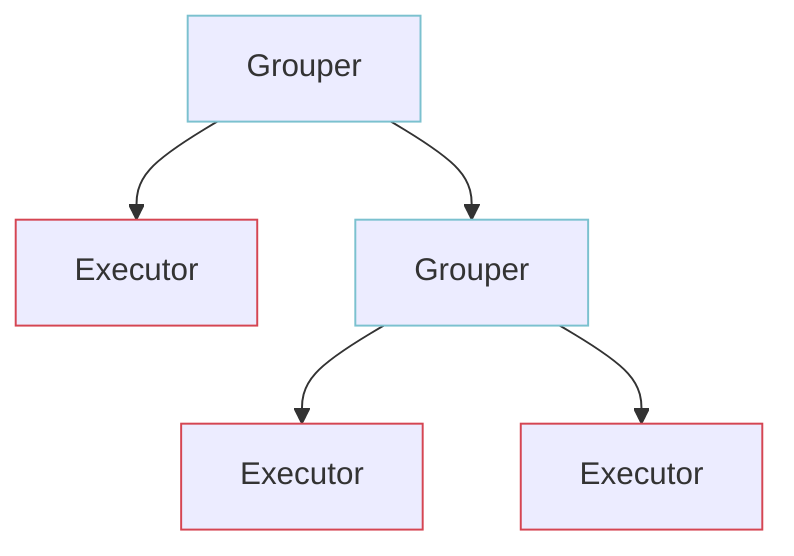

MagaLu Core
===========

This provides the core with generic elements to create a
Software Development Kit (SDK) to be shared between code generator,
TerraForm and command line (CLI).

## Architecture

The solution works by ingesting the OpenAPI descriptions of the products to build an intermediate structure that will then be used to generate the CLI commands and TF components.

The intermediate structure is a tree made up of two types of nodes:

- Grouper: can contain other groups and actions;
- Executor: execute and retain information about HTTP requests.

<!-- TODO: show what part of spec builds what (module, resource, actions)-->
